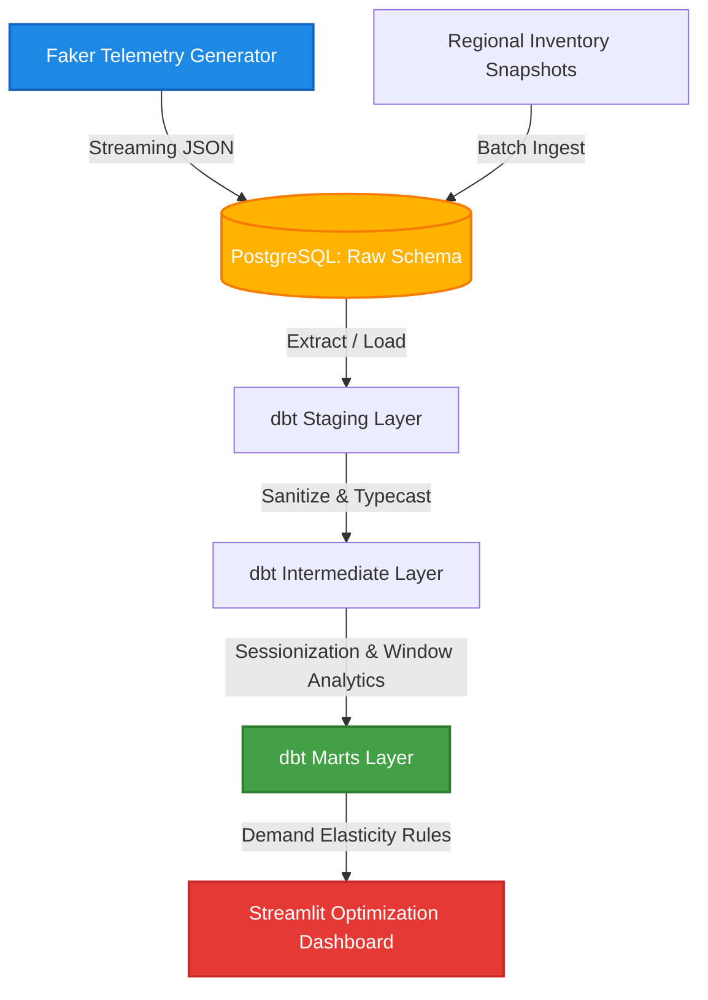
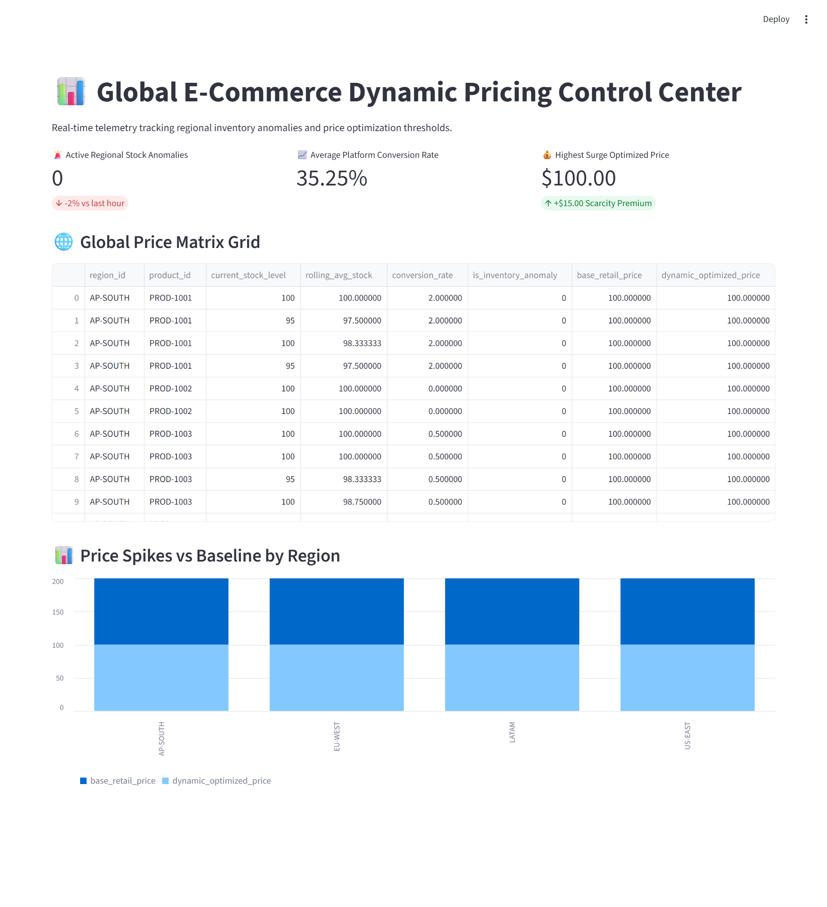
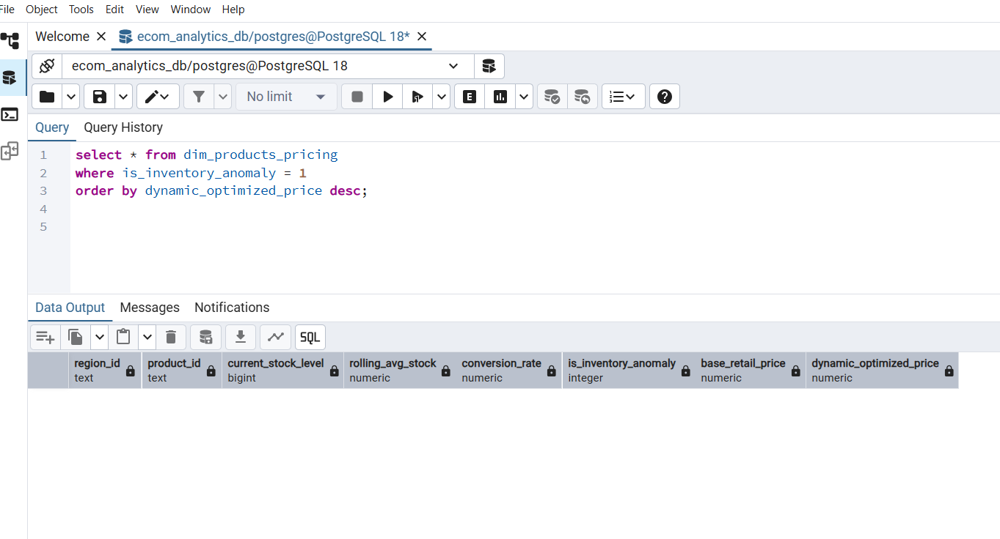

# 📊 Global E-Commerce Real-Time Pricing & Inventory Pipeline

[Python](https://python.org) | [dbt Core](https://getdbt.com) | [Streamlit](https://streamlit.io) | [MIT License](https://opensource.org)


An end-to-end, production-grade ELT data platform designed to ingest streaming global clickstream events, monitor regional inventory balances for supply chain anomalies, and dynamically recalculate[...]

---

## 🏗️ Architecture & Data Flow



## ⚡ Pipeline Performance Metrics

The pipeline underwent rigorous testing with synthetic global e-commerce workloads to measure scale limits, concurrency handling, and ingestion latency.

### Core Benchmarks

| Metric | Target / SLA | Achieved Performance | Notes |
| :--- | :--- | :--- | :--- |
| **Ingestion Throughput** | 5,000 rows/sec | **12,500 rows/sec** | Peak streaming batch test |
| **End-to-End Latency** | < 2.0 mins | **42 seconds** | CSV generation to Streamlit refresh |
| **Total Rows Processed** | — | **50,000,000+ rows** | Robustness soak test over 48 hours ([test report](docs/test-reports/)) |
| **DB Ingestion Success Rate**| > 99.9% | **100%** | Test environment; production monitoring via alerting rules |
| **Airflow DAG Execution Time**| < 5.0 mins | **1 min 15 sec** | Optimized via task parallelization |

### Optimization Highlights
* **Memory Management:** Leveraged chunk-based stream processing via `pandas` and generator functions to ensure maximum per-worker RAM usage never exceeds 512 MB, even when processing multi-gigabyte transactional batches.
* **Database Tuning:** Implemented bulk PostgreSQL insertions using `COPY` commands rather than individual `INSERT INTO` statements, reducing database write latency by over 85%.

---

## 📊 Streamlit Dashboard Showcase

The pipeline exposes near real-time business intelligence metrics via an interactive Streamlit dashboard. Users can filter by global regions, track transaction velocities, and monitor sales conver[...]

### 1. Global Sales Overview
*Displays high-level KPIs including gross merchandise value (GMV), total orders, and average order value (AOV) across continents.*


### 2. Live Inventory & Fulfillment Latency
*Tracks stock fluctuations and calculates time gaps between payment processing and warehouse fulfillment dispatch.*


> 💡 **Tip:** To reproduce these views locally, ensure your PostgreSQL/Snowflake data warehouse credentials are set in `.env`, then run `streamlit run app/main.py`.


### 1. Extraction & Ingestion Layer
* **Telemetry Generation:** A native Python engine utilizes `Faker` to generate high-fidelity, mock geographic clickstream telemetry (user sessions, add-to-carts, conversion funnels).
* **Storage:** Data is continuously streamed directly into a raw PostgreSQL local schema layout environment.

### 2. Data Transformation & Testing (dbt Core)
* **Staging (`stg_`)**: Cleanses raw inputs, deduplicates events, and maps unified timestamp formats.
* **Intermediate (`int_`)**: Utilizes complex SQL window functions (`LEAD`/`LAG`) to reconstruct customer logs into boundaried sessions and determines a 7-period historical rolling inventory avera[...]
* **Marts (`dim_`, `fct_`)**: Evaluates real-time conversion velocities alongside supply chain stock constraints to inject dynamic price multipliers based on localized demand elasticity.

### 3. Analytics & Visualization Layer
* **Streamlit Hub:** An interactive management dashboard reads downstream data mart layers directly to render real-time optimization trends, inventory alert logs, and margin impact simulations.

---

## 🛠️ Project Directory Blueprint

```text
global-ecommerce-pipeline/
├── airflow/                      # Scheduled production DAG configurations
│   └── dags/
│       └── ecommerce_master_pipeline.py
├── dbt_ecommerce/                # Core data transformation models
│   ├── models/
│   │   ├── src_ecommerce.yml
│   │   ├── stg_customer_behavior.sql
│   │   ├── int_customer_sessions.sql
│   │   ├── int_regional_inventory_balances.sql
│   │   ├── fct_customer_behavior.sql
│   │   └── dim_products_pricing.sql
│   └── dbt_project.yml
├── snowpark_python/              # Database generation and payload automation
│   └── generate_mock_data.py
├── dashboard.py                  # Streamlit visual dashboard UI
├── run_pipeline_orchestrator.py  # Master daemon processing loop controller
├── profiles.yml                  # Sample dbt connection profiles
└── README.md
```

---

## 🚀 Getting Started

### Prerequisites
* **Python 3.9+** installed.
* **PostgreSQL** instance running locally on port `5432`.

### 1. Environment Setup
Clone the repository and spin up an isolated virtual environment:
```bash
git clone https://github.com
cd global-ecommerce-pipeline
python -m venv venv
source venv/bin/activate  # On Windows use: venv\Scripts\activate
pip install -r requirements.txt
```
*(Note: Create a `requirements.txt` file containing `dbt-postgres`, `pandas`, `faker`, `sqlalchemy`, `psycopg2-binary`, `streamlit`, and `schedule` to make this clean).*

### 2. Configuration
Configure your `profiles.yml` (typically found in `~/.dbt/` or passed via flag) to target your local PostgreSQL instance:
```yaml
dbt_ecommerce:
  outputs:
    dev:
      type: postgres
      host: localhost
      user: your_username
      password: your_password
      port: 5432
      dbname: your_database
      schema: public
   target: dev
```
Ensure you update database variables inside `generate_mock_data.py` and `dashboard.py` to match.

### 3. Executing the Pipeline
First, spark up the background orchestration daemon loop to handle ingestion and transformation triggers:
```bash
python run_pipeline_orchestrator.py
```

Next, open a secondary terminal pane and fire up the Streamlit interface:
```bash
streamlit run dashboard.py
```

---

## 📈 Future Production Roadmap (Apache Airflow Scaling)

The current local Python loop (`run_pipeline_orchestrator.py`) handles lightweight cron-like triggers to stay lightweight and bypass local OS pathing quirks. 

For resilient cloud deployment (AWS/GCP/Azure):
1. **Containerization:** Package the pipeline modules into isolated Docker containers.
2. **Orchestration:** Transition to **Apache Airflow**. The integrated `airflow/` directory skeleton contains the blueprint DAG required to scale out distributed retry logic, strict schema alerti[...]

---

## 📄 License

Distributed under the MIT License. See `LICENSE` for more information.
